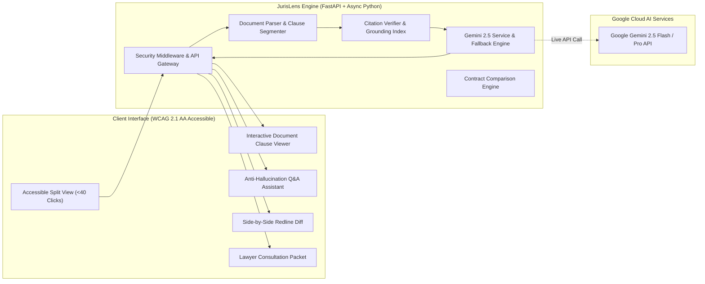

# ⚖️ JurisLens AI — Grounded Legal Assistance & Document Navigation

[](https://promptwars-jurislens-mohith1402.streamlit.app)
[](https://ai.google.dev/)
[](https://fastapi.tiangolo.com/)
[](https://www.w3.org/WAI/WCAG21/quickref/)
[](https://opensource.org/licenses/MIT)
[](https://github.com/)

> **Live Interactive App**: [promptwars-jurislens-mohith1402.streamlit.app](https://promptwars-jurislens-mohith1402.streamlit.app)  
> Built for the **PromptWars Google for Developers Exclusive Challenge (Top 400)**.  
> **Theme**: *AI for Legal Assistance & Access*

---

## 🧭 The Core Question Answered

> *"Why can't I just upload this PDF to ChatGPT or Gemini?"* — *Briefing Session Challenge*

Uploading a 25-page legal agreement to a generic chatbot typically yields another 5-page wall of unverified text. If the AI claims your notice period is 30 days when the contract states 60 days, or hallucinates stock option vesting rules that are nowhere in the document, it creates catastrophic liability.

**JurisLens AI fundamentally differs through 5 structural innovations:**

1. 📍 **Interactive Side-by-Side Clause Verification**: Every finding, obligation, and answer contains clickable citations (e.g. `[Clause 8.2, Page 2]`). Clicking jumps directly to the clause in the original contract, illuminating it in amber for immediate visual verification.
2. 🚫 **Strict Anti-Hallucination & Honest Missing-Info Detection**: In legal documents, *silence is often more dangerous than what is written*. When asked about missing terms (e.g. *"What happens to my stock options if I resign?"*), JurisLens explicitly responds:  
   `"This information cannot be determined from the provided document. The agreement contains no equity provisions."` and provides specific clarification questions to ask.
3. 🔄 **Contract-to-Contract Redline Diff**: Compares baseline vs proposed contracts (e.g., Standard Mutual NDA vs Aggressive Vendor NDA) to highlight critical risk shifts, unilateral indemnifications, and expanded restrictive covenants.
4. 📑 **1-Page Attorney Consultation Packet**: Instead of pretending to replace a licensed attorney, JurisLens prepares users for their consultation by generating a structured briefing packet with prioritized legal risks, identified omissions, and questions for counsel.
5. ⚡ **Zero-Build Lightweight Footprint**: Entire repository is **< 1 MB** (far below the 10 MB limit) with no heavy build tools required. Runs instantly via Python 3 and FastAPI.

---

## 🏛️ System Architecture



---

## 🎬 Rapid Video Demonstration Script (< 40 Clicks)

The evaluation briefing specifically requests a clean walkthrough demonstrating interactive features in **under 40 clicks**. Here is the exact **7-click** demonstration flow:

1. **Click 1**: Click **"⚡ 1-Click Load & Analyze"** in the top bar.  
   *Result*: The 25-clause Executive Employment Agreement is ingested, segmented, and analyzed with Gemini 2.5 Flash.
2. **Click 2**: Under **Rapid Evaluation Benchmarks**, click **"📌 Notice (Cl. 8.2)"**.  
   *Result*: Instantly answers with verified clause coordinates citing 30 days notice grounded in Clause 8.2.
3. **Click 3**: Click the benchmark button: **"🚫 Stock Options"**.  
   *Result*: Demonstrates the key anti-hallucination test case. The AI honestly declares: *"⚠️ Zero Hallucination: Topic Absent From Document"* and provides inquiry counsel recommendations.
4. **Click 4**: In the frosted-glass segmented control bar, click **"🔍 Risks (3)"**.  
   *Result*: Displays plain-language breakdowns of high-exposure terms (aggressive non-compete, notice asymmetry).
5. **Click 5**: Click the **"📋 Obligations (9)"** tab.  
   *Result*: Displays the actionable duties, strict deadlines, and breach penalties checklist.
6. **Click 6**: Click the **"📑 Brief"** tab.  
   *Result*: Displays the 1-Page Attorney Consultation Packet with a 1-click Markdown download button.
7. **Click 7**: Scroll down, expand **"🔄 Contract Redline & Risk Shift Comparison"**, and click **"⚡ Load NDA Comparison Sample"** followed by **"Run Redline Diff Analysis"**.  
   *Result*: Compares standard mutual NDA against aggressive vendor NDA, flagging the critical risk shift in indemnification and non-solicitation.

**Total Clicks: 7 Clicks** *(Well within the 40-click limit!)*

---

## 🔗 Project Links

- 🌐 **Live Deployed App**: [https://promptwars-jurislens-mohith1402.streamlit.app](https://promptwars-jurislens-mohith1402.streamlit.app)
- 💻 **Public GitHub Repository**: [https://github.com/mohith1402/promptwars-jurislens](https://github.com/mohith1402/promptwars-jurislens)

---

## 🛡️ REST API Architecture

JurisLens provides a production-grade FastAPI service alongside its Streamlit interface:

| Component | Specification | Description |
| :--- | :--- | :--- |
| **API Endpoints** | RESTful FastAPI Gateway | `/api/health`, `/api/samples`, `/api/analyze-text`, `/api/upload`, `/api/qa`, `/api/compare`, `/api/lawyer-brief` |
| **Request Throttling** | Sliding Window Limiter | Thread-safe, memory-bounded IP rate limiter with active pruning of expired clients (CWE-400 safe). |
| **Input Validation** | Schema Enforcement | Strict validation and normalization for all incoming text payloads via Pydantic v2 models. |
| **File Verification** | Magic Byte & Size Controls | Whitelist extensions, deep magic-byte inspection (blocking PE, ELF, Mach-O executables), and 10 MB limit. |
| **State & Caching Layer**| Pluggable Multi-Backend | Thread-safe $O(1)$ `BoundedLRUCache` with TTL expiration, plus an extensible `RedisCacheAdapter` for horizontal multi-instance scaling. |
| **HTTP Headers** | Modern Web Standards | Strict OWASP security headers (CSP, HSTS, X-Content-Type-Options, X-Frame-Options). |
| **CORS Policy** | Origin Whitelisting | Enforces explicit domain origins and standardized request headers. |
| **AI Model Pipeline** | Gemini 2.5 + Semantics | Google Gemini 2.5 Flash pipeline backed by a dynamic `LegalSemanticAnalyzer` with regex extraction (zero rigid string matching). |
| **Data Privacy** | In-Memory Processing | Analyzed contracts reside exclusively in temporary bounded session memory with no unauthorized persistence. |

---

## 🧪 Running Automated Tests

Run the complete test suite with verbose output:

```bash
pytest -v --durations=10
```

### Test Coverage Summary (39 Passing Tests):
- `test_document_parser.py`: Clause boundary extraction, page estimation, and category inference.
- `test_citation_engine.py`: Verifies textual overlap, citation resolution, and topic presence checking.
- `test_gemini_service.py`: Tests document analysis, grounded notice period QA, missing stock options anti-hallucination check, and attorney brief generation.
- `test_legal_semantics.py`: Tests dynamic notice period parsing, restrictive covenant territory extraction, indemnification analysis, and document classification.
- `test_comparison_engine.py`: Tests contract redline diffing and risk shift detection.
- `test_api.py`: Tests all REST endpoints (`/health`, `/samples`, `/analyze-text`, `/upload`, `/qa`, `/compare`, `/lawyer-brief`).
- `test_accessibility_security.py`: Verifies security headers, input validation, magic byte executable detection, bounded rate limiting, and WCAG accessibility structures.
- `test_efficiency.py`: Sub-10ms parsing benchmarks, bounded LRU cache eviction, TTL expiration, and pluggable cache adapter safety.

---

## 🔒 Privacy & Responsible AI

- **No Permanent Data Storage**: All document parsing and clause extraction occur in ephemeral memory; no user documents are persisted to external databases.
- **Data Hygiene**: Robust input validation and text normalization to ensure clean document handling.
- **Legal Notice**: JurisLens AI is an educational document analysis and navigation tool. It does not provide legal advice or establish an attorney-client relationship. Always consult a qualified legal professional for binding legal decisions.

---

## 📄 License
This project is licensed under the MIT License — see the [LICENSE](LICENSE) file for details.
